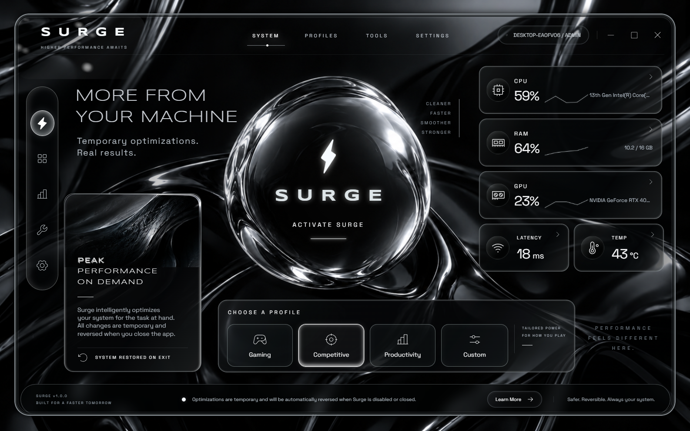
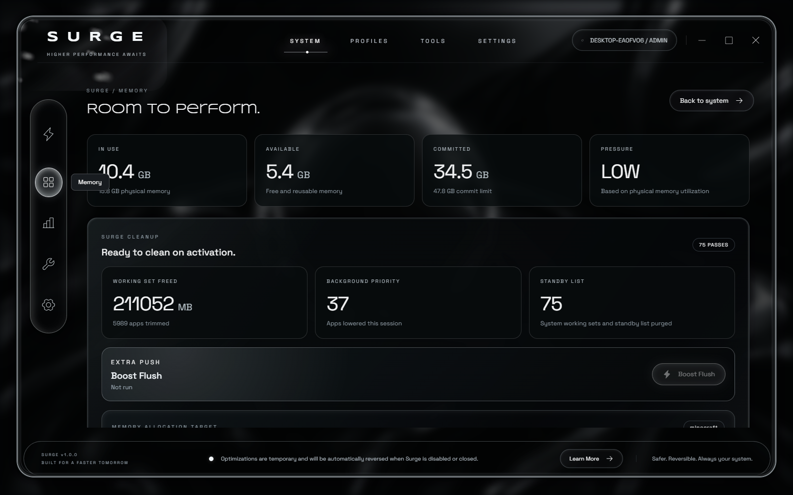
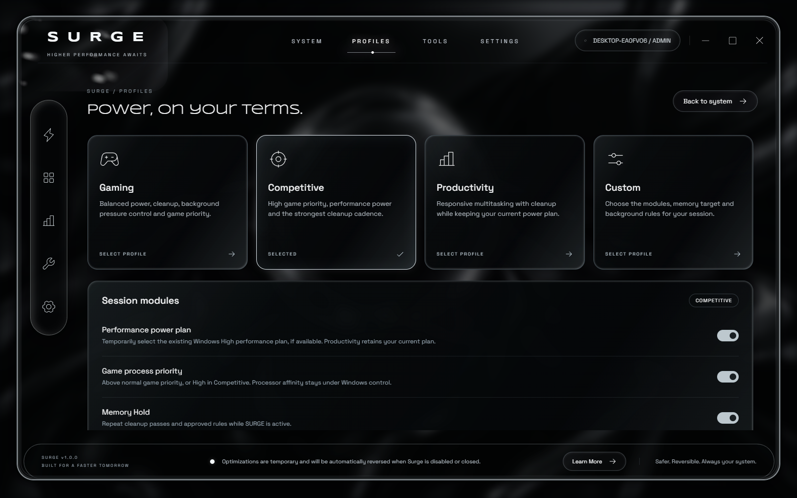
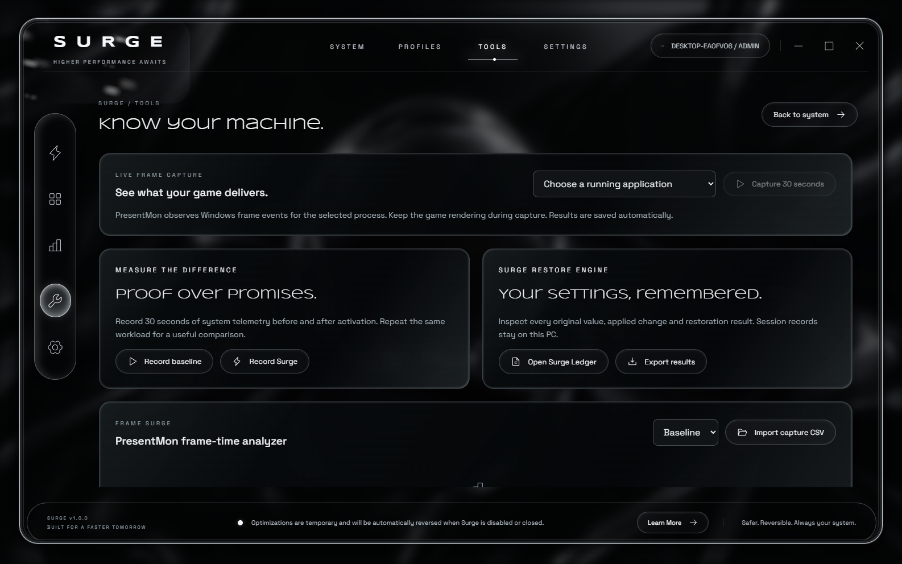
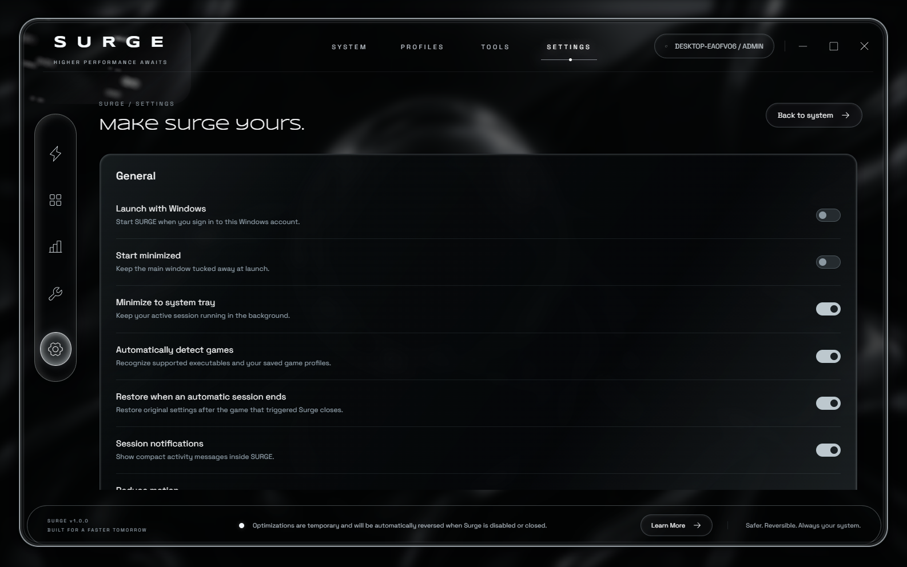

# SURGE — Windows Performance Optimizer



SURGE is a polished Windows performance-control app for users who want a cleaner, sharper session before gaming, streaming, recording, editing, or heavy multitasking. It focuses on temporary optimization passes that can be inspected and restored: memory pressure reduction, standby-list cleanup, process focus, background contention control, network refresh, disk optimization kickoff, and benchmark evidence.

[Download the latest release](https://github.com/P1utoA1/SURGE-downloads/releases/latest) · [Open the website](https://p1utoa1.github.io/SURGE-downloads/) · [Verify SHA256](SHA256SUMS.txt)

SURGE should be launched as administrator so the full optimization engine can access Windows memory and network APIs. The source project stays private while this public repository hosts the download page, screenshots, checksum, and release files.

## What you get

- **OLED-black liquid-glass interface** inspired by the SURGE desktop UI, with reflective chrome panels, soft motion, animated ambience, and readable live telemetry.
- **One-click activation** that applies the selected profile, records reversible changes, and keeps cleanup passes running while SURGE is open.
- **Boost Flush** for an extra manual push: standby-list purge, safe working-set trim, SURGE heap compaction, and live telemetry refresh.
- **Memory Allocation Target** so users can choose a running process or browse to an executable, analyze it, save it, and focus the session around that workload.
- **Profiles** for Gaming, Competitive, Productivity, and Custom behavior.
- **Tools and benchmarks** for baseline-versus-SURGE captures, PresentMon CSV frame-time analysis, and exportable session data.
- **Surge Ledger** that records changes and restoration status so the optimization session is visible instead of hidden.

## Screenshots

| System dashboard | Memory optimizer |
| --- | --- |
|  |  |

| Profiles and modules | Tools and benchmarks |
| --- | --- |
|  |  |

| Settings and motion options |
| --- |
|  |

## How SURGE works inside

SURGE runs as a native Windows desktop application with a local-only React interface and a .NET optimization engine. The UI talks to the engine over `127.0.0.1`, so the control surface stays on the PC. When launched as administrator, the engine can reach Windows APIs that normal apps cannot use, including memory-list cleanup and network tuning operations.

During an active session, SURGE samples CPU, memory, GPU, network, process, and adapter data. It then applies the selected profile using reversible actions where Windows allows it. Examples include switching to an existing high-performance power plan, trimming safe background process working sets, lowering safe background priorities, flushing DNS, applying supported TCP tuning, starting Windows volume optimization, and purging system working sets or standby memory when elevated.

The app does not spoof telemetry or claim guaranteed FPS gains. Windows, drivers, games, routers, cables, and ISP limits still matter. SURGE focuses on reducing avoidable local contention and making those changes visible, repeatable, and restorable.

## Download and verify
Current package: `SURGE-v1.0.0-20260913-001448-win-x64.zip`

SHA256:

```text
25CC1B8B4777100BDC59252B6E1A9B3DCC67F2E1045552BAE2C4743D0640CAB9
```

Download from the [latest release page](https://github.com/P1utoA1/SURGE-downloads/releases/latest), unzip the package, and run `Surge.exe`. Windows administrator approval is recommended so all optimizer modules can run.

## Distribution model

This public repository hosts the website, screenshots, checksums, and release downloads. The editable source project is maintained separately as a private repository, so users can view and download the app without receiving the application source code.
