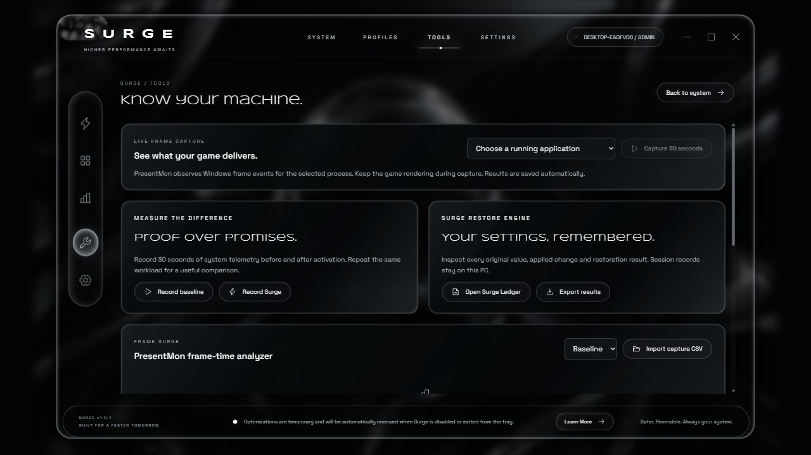
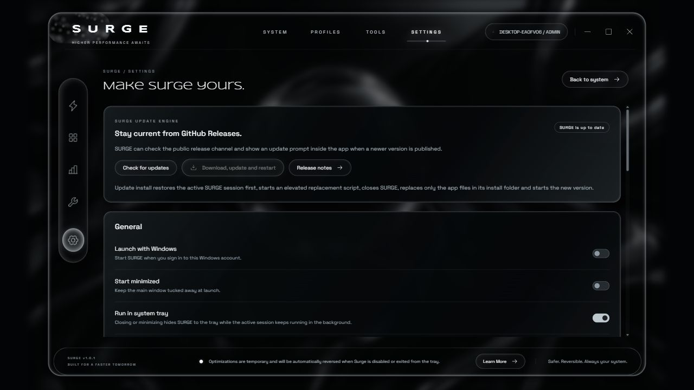

# SURGE — Windows Performance Optimizer


SURGE is a polished Windows performance-control app for users who want a cleaner, sharper session before gaming, streaming, recording, editing, or heavy multitasking. v1.0.2 changes the optimizer around whole-PC responsiveness: it preserves healthy Windows cache, avoids disruptive disk/service work by default, measures SURGE's own overhead, and rolls back harmful process/service changes through Performance Guard.

[Download the latest release](https://github.com/P1utoA1/SURGE-downloads/releases/latest) · [Open the website](https://p1utoa1.github.io/SURGE-downloads/) · [Verify SHA256](SHA256SUMS.txt)

SURGE should be launched as administrator so the full optimization engine can access Windows memory and network APIs. The source project stays private while this public repository hosts the download page, screenshots, checksum, and release files.

## What you get

- **OLED-black liquid-glass interface** inspired by the SURGE desktop UI, with reflective chrome panels, soft motion, animated ambience, and readable live telemetry.
- **One-click activation** that applies the selected profile, records reversible changes, and keeps cleanup passes running while SURGE is open.
- **Pressure-aware memory control** that skips cleanup when the PC already has enough available memory instead of chasing the lowest RAM number.
- **Performance Guard** that watches whole-system responsiveness and can revert disruptive priority, suspension, or service changes during the active session.
- **Boost Flush** for an extra manual push: guarded standby-list cleanup, safe working-set trim, SURGE heap compaction, and live telemetry refresh.
- **Memory Allocation Target** so users can choose a running process or browse to an executable, analyze it, save it, and focus the session around that workload.
- **Profiles** for Gaming, Competitive, Productivity, and Custom behavior.
- **Tools and benchmarks** for baseline-versus-SURGE captures, PresentMon CSV frame-time analysis, and exportable session data.
- **Surge Ledger** that records changes and restoration status so the optimization session is visible instead of hidden.
- **System tray mode** so closing or minimizing can tuck SURGE into the tray while the active session keeps running.
- **Optional notifications** that stay off by default and can be enabled in Settings for optimization, update and activity changes.
- **Auto updater** that checks GitHub Releases, shows a direct in-app update prompt, downloads the newest package when accepted, replaces the app files and restarts SURGE.
- **App-only uninstaller** that restores SURGE effects first, closes the app if it is running, then deletes only the SURGE install folder and SURGE local state.

## Screenshots

| System dashboard | Memory optimizer |
| --- | --- |
|  |  |

| Tools and benchmarks | Settings, updater and tray |
| --- | --- |
|  |  |

## How SURGE works inside

SURGE runs as a native Windows desktop application with a local-only React interface and a .NET optimization engine. The UI talks to the engine over `127.0.0.1`, so the control surface stays on the PC. When launched as administrator, the engine can reach Windows APIs that normal apps cannot use, including memory-list cleanup and network tuning operations.

During an active session, SURGE samples CPU, memory, GPU, network, process, adapter data, disk load and SURGE's own CPU/memory footprint. It then applies smaller reversible actions only when useful. Examples include switching to an existing high-performance power plan, capped Above Normal app priority, controlled working-set trims under real memory pressure, DNS refresh, supported TCP tuning, and optional disk/service work only when enabled. The tray keeps the session accessible after the window is hidden, while the updater talks to this public GitHub Releases channel to find newer packages.

The app does not spoof telemetry or claim guaranteed FPS gains. Windows, drivers, games, routers, cables, and ISP limits still matter. SURGE focuses on reducing avoidable local contention without making Explorer, input, browsers, communication apps, storage, or the rest of Windows feel worse.

## v1.0.2 regression fix

This release addresses the published-build issue where RAM usage could drop and FPS could improve while the rest of the PC became sluggish. The optimizer now treats a slower desktop as a failed optimization.

- Aggressive memory cleanup, service pausing, and disk optimization are off by default for new installs.
- Normal cleanup preserves useful Windows standby/cache when available memory is already healthy.
- System working-set purge is removed from normal cleanup and reserved away from the default path.
- Background priority changes are limited to a small number of high-CPU, non-interactive candidates.
- Competitive/focused app priority is capped at Above Normal, not High or Realtime.
- The telemetry loop samples slower while idle/restored to reduce SURGE's own overhead.
- The UI now reports System Responsiveness, SURGE overhead, memory policy, and Guard status.

## Download and verify
Current package: `SURGE-v1.0.2-20260914-224851-win-x64.zip`

SHA256:

```text
8D1BA1C9D6111AF23EA2526886057077450F7A434872BD6FBF1BE9E92E9A0313
```

Download from the [latest release page](https://github.com/P1utoA1/SURGE-downloads/releases/latest), unzip the package, and run `Surge.exe`. Windows administrator approval is recommended so all optimizer modules can run.

## Distribution model

This public repository hosts the website, screenshots, checksums, and release downloads. The editable source project is maintained separately as a private repository, so users can view and download the app without receiving the application source code.


